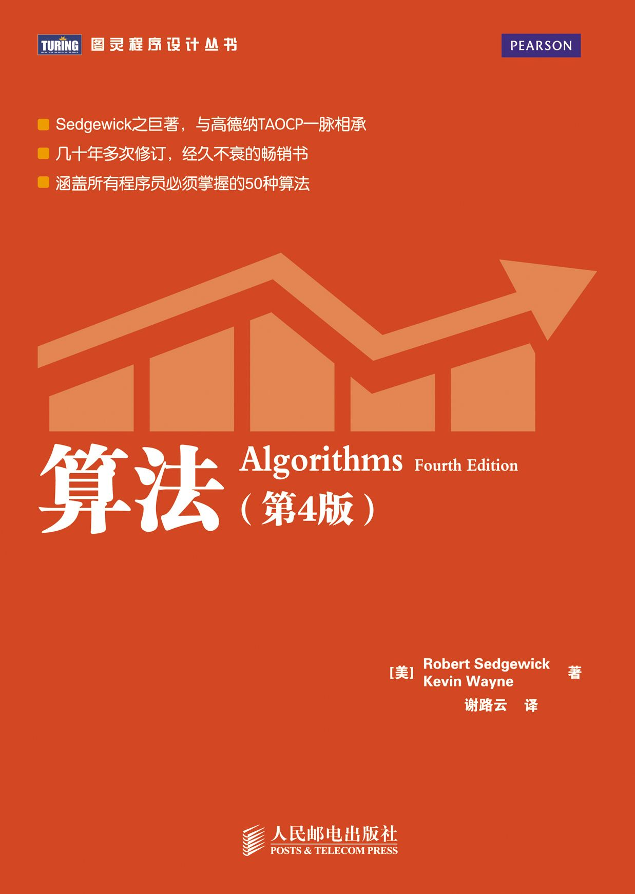

# Algorithms in Golang
### 对于我来说，学习算法的最好机会是十年前，其次是现在。

## 目录
- [1.基础](./1.Fundamentals)
    - [1.1.基础编程模型](./1.Fundamentals/1.1.BasicProgrammingModel)
    - [1.2.数据抽象](./1.Fundamentals/1.2.DataAbstraction)
    - [1.3.背包、队列和栈](./1.Fundamentals/1.3.BagsQueuesAndStacks)

### 2017-04-20
1.2小节还是有几题没有做，我就开始1.3了。

### 2017-04-17
编写了一个tamplate.go来自动生成某个小节的答案模板文件和README.md文件。自动化处理就是爽。

### 2017-04-12
经过这两天的做题，我才发现我应该把其中一部分习题封装成库的。这样，就可以使用测试文件来验证了。很多题目也是相通的，不用重复劳动。

### 2017-04-10
经过这几天的思考，我计划采用最笨最慢的方法，每周学习本书的一个章节。到2017年9月25日，可以完成本书前5章的学习。

### 2017-04-07
Robert Sedgewick的"Algorithms, 4th Edition"是基于Java语言实现的，但是我更喜欢Golang。我决定学习这一本书，并把前5章的算法，用Golang实现一遍。

## 参考资料
1. [算法（第4版）](https://book.douban.com/subject/19952400)
